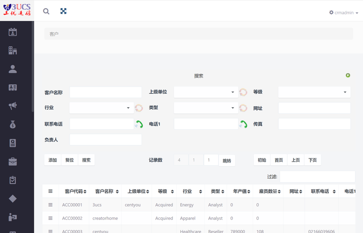
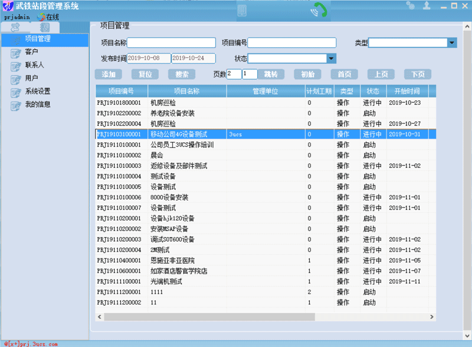
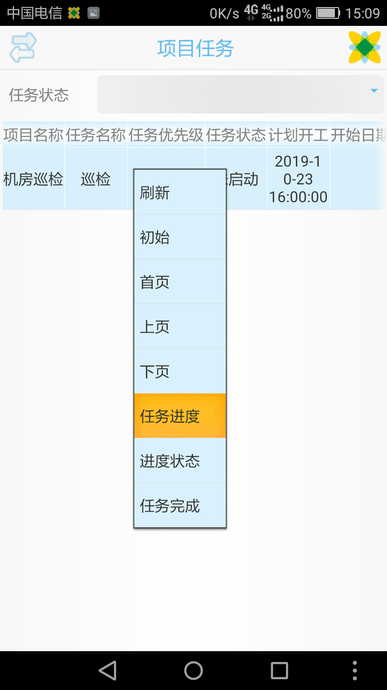

# ViterCrm-Chinese-xPlus
CRM Based ViterCRM v6, Chinese Version, depend on xPlus.  User can Use Mobile Client、PC Client、Browser to Acess the sevice!

C/S、B/S双架构，完美运行于手机客户端、电脑客户端和主流浏览器 .

源代码太多，在安装目录下（vtiger文件夹，直接下载release的exe安装包，简单方便），此处，只上传一丢丢。

截图及演示地址：http://prj.3ucs.com

可参考ERP视频资料

音视频演示(3UCS ERP安装部署) http://3ucs.com/video.php?vid=45

音视频演示(3UCS ERP基础功能) http://3ucs.com/video.php?vid=42

音视频演示(x+网页版安装部署) http://3ucs.com/video.php?vid=53

Discuss（在线客服）

Contact us at  if you have feedback, questions or want to chat. 

